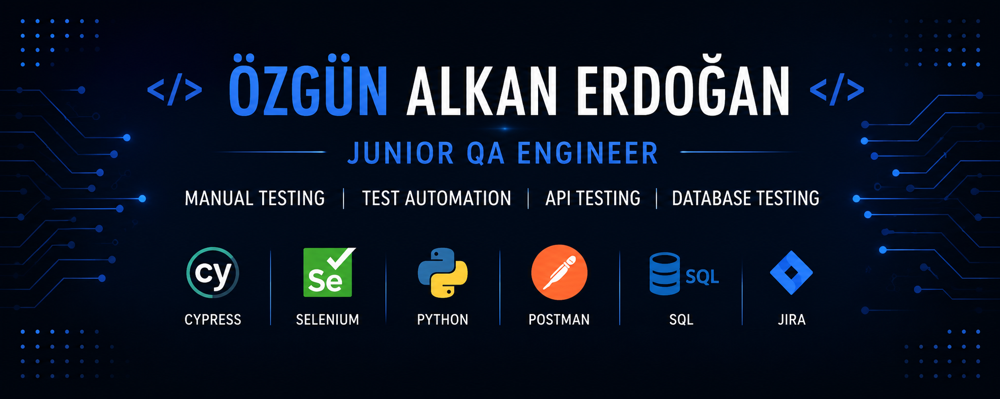

  

Hi, I'm Özgün 👋

### Junior QA Engineer

I'm a Junior QA Engineer with hands-on experience in **Manual Testing, Test Automation, API Testing, Database Testing, and End-to-End Testing**.

I have practical experience with **Cypress, JavaScript, Postman, SQL, Jira, and TestRail**, including writing and executing test cases, reporting and tracking bugs, API testing, database validation, and developing automated E2E tests.

I'm currently expanding my automation skills with **Python and Selenium WebDriver**, while also learning more about **AI-assisted test automation, Playwright, and CI/CD practices**.

💼 **Open to:** Junior QA Engineer • Software Test Engineer • QA Automation opportunities

---

## 🛠️ Tech Stack

### Testing & Automation

**Manual Testing • Functional Testing • Regression Testing • E2E Testing • API Testing • UI Testing • Cross-Browser Testing**

### Programming & Database

### QA & Development Tools

**TestRail • Trello**

---

## 🌱 Currently Learning & Expanding

**Python • Selenium WebDriver • Playwright • CI/CD • AI-Assisted Test Automation**

---

## 📫 Connect With Me

I'm open to opportunities where I can contribute to software quality while continuing to grow in test automation.

